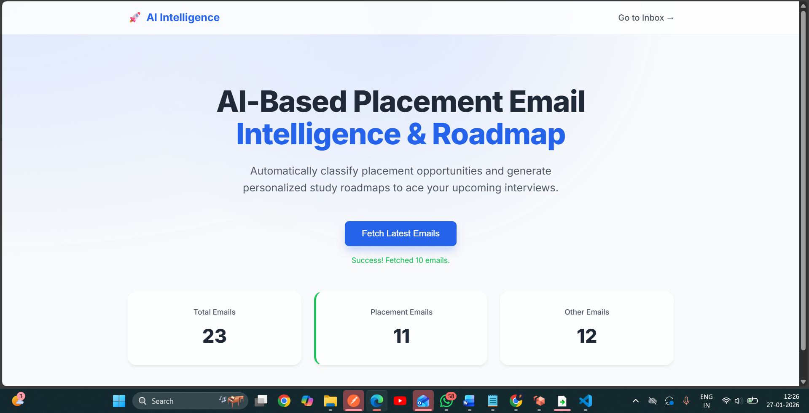
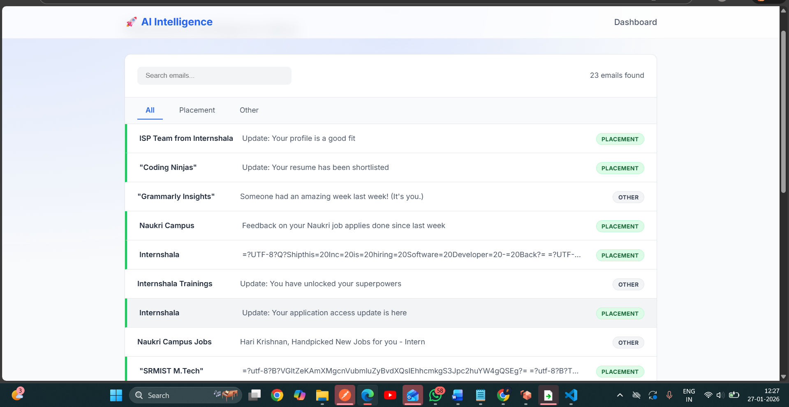
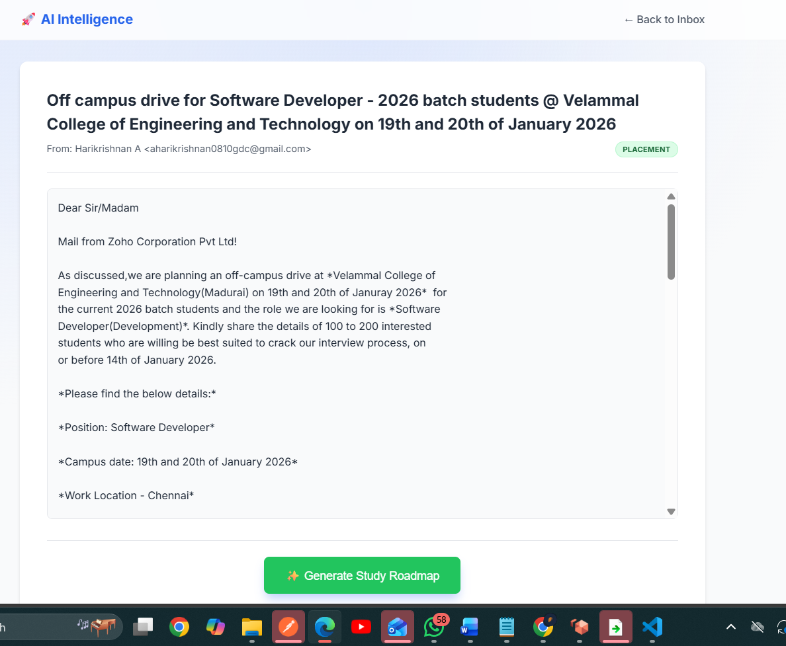
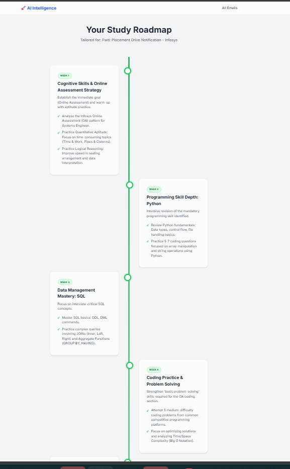

# 📧 AI Email-Driven Roadmap Generator

An intelligent web application that reads user emails, understands their intent using AI techniques, and automatically generates a **personalized roadmap** from email content.

---

## 🚀 Project Overview

This project helps users extract meaningful action plans from emails. Many users describe goals, tasks, or learning needs through emails, which are often unstructured.  
The AI-powered system converts emails into **clear, structured, step-by-step roadmaps** that can guide tasks, learning paths, or project planning.

---

## 🎯 Features

- 📩 **Fetch Emails**: Automatically fetch emails from Gmail using the API.  
- 🧠 **AI Processing**: Classifies email content and extracts actionable information.  
- 🗺️ **Roadmap Generation**: Converts email insights into structured roadmaps.  
- 🌐 **Web Interface**: View emails, read message content, and see generated roadmaps in a user-friendly interface.  
- 🔒 **Security**: Sensitive data managed with `.gitignore` to prevent exposure.

---

## 🛠️ Technologies Used

- **Backend:** Python, Flask  
- **AI / NLP:** Custom logic for email parsing and classification  
- **Email Integration:** Gmail API  
- **Frontend:** HTML, CSS, JavaScript  
- **Environment:** Python Virtual Environment  

---

## 📸 Screenshots

**1️⃣ Fetch Email**  


**2️⃣ Inbox View**  


**3️⃣ Email Body View**  


**4️⃣ Generated Roadmap**  


---

## ⚙️ Installation & Setup

1. Clone the repository:
```bash
git clone https://github.com/aharikrishnan0810/Ai_email-roadmap.git
cd Ai_email-roadmap
